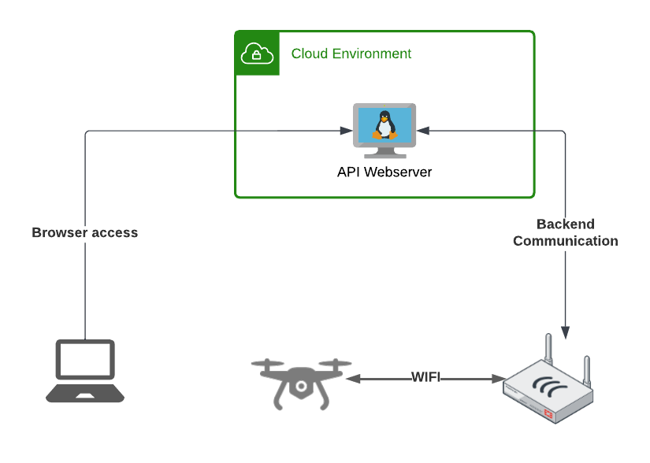

# HTTP API for DJI Tello Drone

This Repository contains an HTTP based API for the [DJI Tello Drone](https://www.ryzerobotics.com/de/tello-edu). This allows to control the Drone via HTTP GET/POST Commands instead of sending RAW UDP packages to the Drone itself.

To start, use the [Quickstart](./documentation/quickstart.md) documentation.
Detailed Information can be found within the folder of each component or within the documentation folder:
- [Documentation](./documentation/README.md)
- [API Webserver](./api_container/README.md)
- [API Middleware](./api_middleware/README.md)

## Architecture
