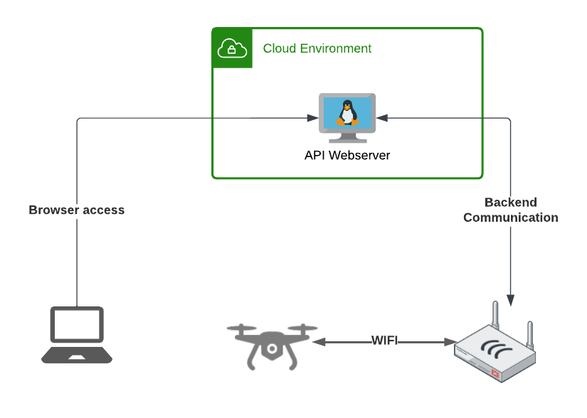

# Documentation
This Project allows to Controle a DJI Tello Drone via API Commands. The API Server itself is designed to run as a Cloud Instance and has a secure connection etwablished back to the API Middleware which acts as a Groundstation. This secure tunnel can be eg. a VPN or SSH tunnel. 

The client will reach out to the API Webserver and call a Endpoint. This call will be translated into a UDP packet by the 'telloclient.py' module. This packet will be then send to the API middleware where it will be distributed to the right Drone.

- [Quickstart Guide](./quickstart.md)

## Architecture


## Communication Diagram
```text
 .------.                          .----------.                     .----------.                                      .-----.
 |Client|                          |API Server|                     |Middleware|                                      |Drone|
 '------'                          '----------'                     '----------'                                      '-----'
    |                                   |                                |                                               |   
    |HTTP Request to API Endpoint (HTTP)|                                |                                               |   
    |---------------------------------->|                                |                                               |   
    |                                   |                                |                                               |   
    |                                   |Translated API Command (RAW UDP)|                                               |   
    |                                   |------------------------------->|                                               |   
    |                                   |                                |                                               |   
    |                                   |                                |               Command (RAW UDP)               |   
    |                                   |                                |---------------------------------------------->|   
    |                                   |                                |                                               |   
    |                                   |                                |Return Success Status / Error Message (RAW UDP)|   
    |                                   |                                |<----------------------------------------------|   
    |                                   |                                |                                               |   
    |                                   | Drone Return Message (RAW UDP) |                                               |   
    |                                   |<-------------------------------|                                               |   
    |                                   |                                |                                               |   
    |Display Drone Return Message (HTTP)|                                |                                               |   
    |<----------------------------------|                                |                                               |   
 .------.                          .----------.                     .----------.                                      .-----.
 |Client|                          |API Server|                     |Middleware|                                      |Drone|
 '------'                          '----------'                     '----------'                                      '-----'
```
- Example communication for `/status/connection-test` Endpoint:
```text
 .------.                             .----------.   .----------.
 |Client|                             |API Server|   |Middleware|
 '------'                             '----------'   '----------'
    |                                      |              |      
    |   HTTP GET /status/connection-test   |              |      
    |------------------------------------->|              |      
    |                                      |              |      
    |                                      |RAW UDP "ping"|      
    |                                      |------------->|      
    |                                      |              |      
    |                                      |RAW UDP "pong"|      
    |                                      |<-------------|      
    |                                      |              |      
    |HTTP JSON response "{"status":"pong"}"|              |      
    |<-------------------------------------|              |      
 .------.                             .----------.   .----------.
 |Client|                             |API Server|   |Middleware|
 '------'                             '----------'   '----------'
```

## API Capabilities
### Postman Collection
- [Postman Collection](./tello_custom_api.postman_collection.json)

### API Endpoint overview

- [Detailed API Endpoint overview](./api-overview.md)

Endpoint | Data | Method | Description
---------|------|--------|-------------
/command | - | POST | Configure the Drone to accept commands from API Interface
/emergency | - | POST | Emergency Stop of the Drone
/stop | - | POST | Let the Drone hover in the Air
/motor | `{"status":""}` | POST | Turns Drone motor on or off
/takeoff | - | POST | Takeoff the Drone
/land | - | POST | Land the Drone
/move | `{"direction":"", "distance": }` | POST | Move the Drone in various direction (Distance is in centimeter!)
/rotate | `{"direction":"", "degrees": }` | POST | Rotate the Drone clockwise or counterclockwise
/flip | `{"direction":""}` | POST | Flip the Drone in various direction
/status/battery | - | GET | Returns the Battery capacity in percentage
/status/speed | - | GET | Returns the actual flight speed (Value is in centimeter!)
/status/flighttime | - | GET | Returns the time how long the Drone already was in air
/status/connection-test | {"host":"", "port":} | GET/POST | Initiate Connection test to Middleware; Allows to change host and port off middleware for testing purpose
/status/os-info | {"cmd":""} | GET/POST | Returns OS reease Informaton; allows to execute OS Command via POST for testing purpose